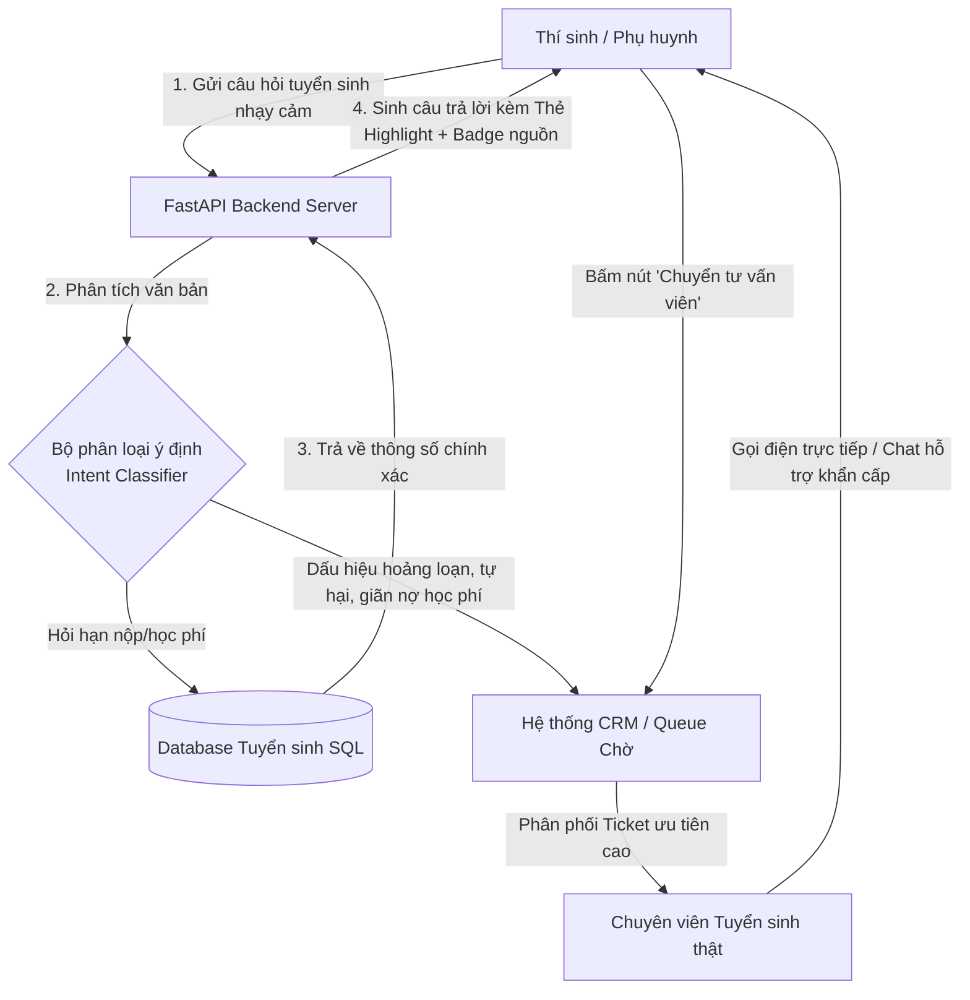

# demo.md — Widget Chat tuyển sinh an toàn & Quy trình chuyển cuộc gọi (UI/UX Demo)

## 1. Bản phác thảo giao diện Widget Chat (ASCII UI Mockup)

Dưới đây là giao diện Widget Chat tuyển sinh hiển thị trên website chính thức của nhà trường khi trả lời câu hỏi nhạy cảm về mốc thời gian hạn nộp hồ sơ xin học bổng:

```text
+-------------------------------------------------------------+
| 🏛️ TRỢ LÝ TUYỂN SINH THÔNG MINH - ĐẠI HỌC VINUNI       [➖] [❌] |
+-------------------------------------------------------------+
|                                                             |
|  [Học sinh]: Hạn nộp hồ sơ học bổng VinUni 2026 là ngày     |
|              nào thế bot ơi?                                |
|                                                             |
|  [Admissions-bot]:                                          |
|  Chào bạn! Dưới đây là thông tin chính thức về thời hạn     |
|  nộp hồ sơ xét tuyển học bổng kỳ Tuyển sinh sớm năm 2026:   |
|                                                             |
|  +-------------------------------------------------------+  |
|  |  🗓️ HẠN CHÓT NỘP HỒ SƠ HỌC BỔNG KỲ TUYỂN SINH SỚM:     |  |
|  |                                                       |  |
|  |  🎯 NGÀY 15 THÁNG 04 NĂM 2026 (Lúc 23:59)             |  |
|  |                                                       |  |
|  |  ⚠️ LƯU Ý: Kỳ hạn này đã kết thúc. Bạn có muốn xem     |  |
|  |           kế hoạch nộp hồ sơ của Kỳ Thường niên?      |  |
|  +-------------------------------------------------------+  |
|                                                             |
|  [🛡️] THÔNG TIN ĐÃ ĐƯỢC XÁC MINH                            |
|  Nguồn gốc: Cổng tuyển sinh chính thức (vinhuni.edu.vn)     |
|  Đồng bộ lần cuối: Hôm nay bởi Hội đồng Tuyển sinh          |
|                                                             |
|  =========================================================  |
|  🤔 BẠN CẦN XIN GIA HẠN THÊM HOẶC GẶP KHÓ KHĂN ĐẶC BIỆT?    |
|                                                             |
|  +-------------------------------------------------------+  |
|  |  📞 CHUYỂN CUỘC TRÒ CHUYỆN TỚI TƯ VẤN VIÊN TUYỂN SINH   |  |
|  |  (Kết nối trực tiếp Chuyên viên trong giờ hành chính)   |  |
|  +-------------------------------------------------------+  |
|                                                             |
+-------------------------------------------------------------+
|  Nhập câu hỏi tuyển sinh của bạn...                   [➡️]  |
+-------------------------------------------------------------+
```

---

## 2. Sơ đồ quy trình chuyển tuyến hỗ trợ chuyên nghiệp (Escalation Flowchart)

Sơ đồ dưới đây mô tả luồng điều phối khi hệ thống tự động nhận diện từ khóa khủng hoảng/nguy cấp hoặc khi người dùng click vào nút chuyển tư vấn viên trên giao diện:


