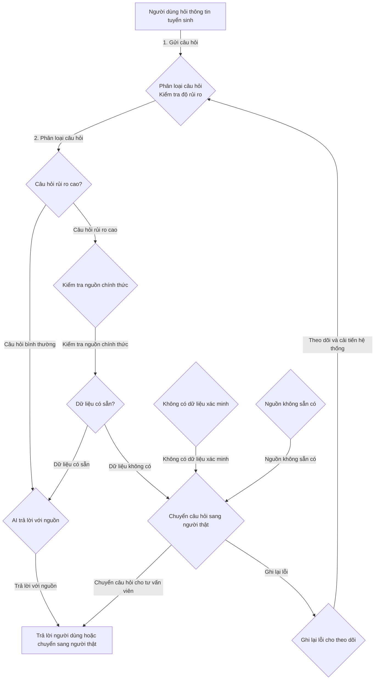

# Demo Kiến Trúc Dữ Liệu

File này dùng để đặt sơ đồ và mô tả ngắn cách hệ thống giảm rủi ro.

## 1. Sơ đồ cách hệ thống xử lý

## 2. Thành phần chính

| Thành phần                        | Nhận gì?                       | Làm gì?                                         | Trả ra gì?                                |
|-----------------------------------|--------------------------------|-------------------------------------------------|-------------------------------------------|
| Phân loại câu hỏi                | Câu hỏi người dùng             | Xác định câu hỏi có rủi ro cao hay không        | Trả lời hoặc yêu cầu kiểm tra nguồn      |
| Nguồn chính thức                 | Chủ đề cần kiểm tra            | Lấy dữ liệu chính thức từ nguồn                | Thông tin và nguồn                       |
| Bộ xử lý khi thiếu nguồn         | Kết quả không có dữ liệu       | Không cho AI đoán, chuyển sang người thật      | Yêu cầu chuyển sang người thật          |
| Ghi lại lỗi                       | Câu hỏi + kết quả             | Lưu trữ lỗi để theo dõi và cải tiến sau        | Danh sách lỗi lặp lại                    |

## 3. Khi hệ thống gặp vấn đề

| Khi nào lỗi xảy ra?                        | Hệ thống làm gì?                                  | Người dùng thấy gì?              |
|-------------------------------------------|---------------------------------------------------|----------------------------------|
| Nguồn chính thức không có dữ liệu        | Yêu cầu chuyển sang người thật                   | Người dùng được thông báo chuyển sang tư vấn viên  |
| Nguồn bị lỗi hoặc quá chậm               | Báo lỗi và yêu cầu cập nhật lại nguồn dữ liệu    | Thông báo lỗi và thông tin về trạng thái hiện tại |
| Câu hỏi vượt phạm vi AI                  | Từ chối trả lời, hướng đến kênh hỗ trợ phù hợp   | Người dùng được hướng dẫn tới kênh phù hợp |
| Lỗi này lặp lại nhiều lần                | Ghi lại lỗi và cải tiến quy trình                 | Người dùng không thấy gì, nhưng hệ thống cải thiện |

## 4. Kiểm tra nhanh

- [ ] Sơ đồ không chỉ là “AI trả lời tốt hơn”, mà có bước kiểm tra cụ thể.
- [ ] Có cách xử lý khi thiếu dữ liệu.
- [ ] Có cách chuyển sang người thật.
- [ ] Có cách theo dõi để lần sau sửa tốt hơn.
